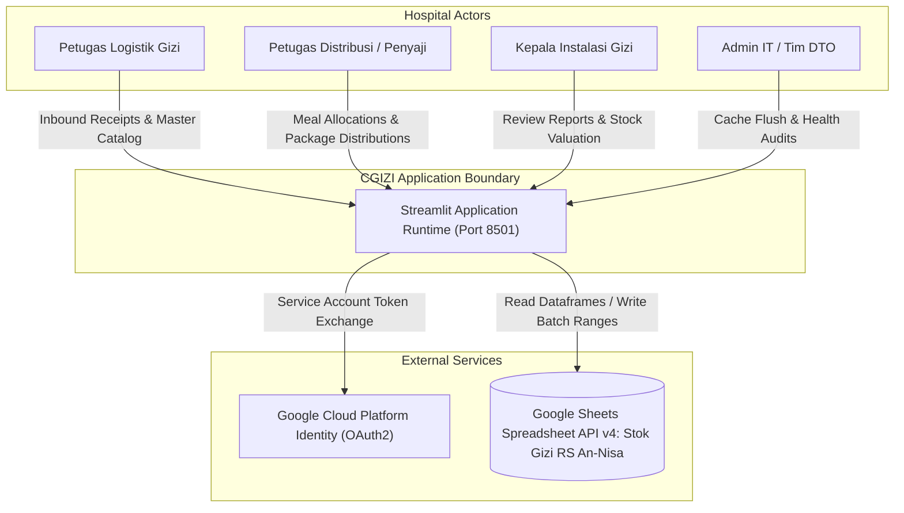
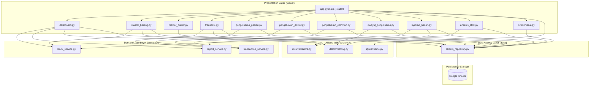
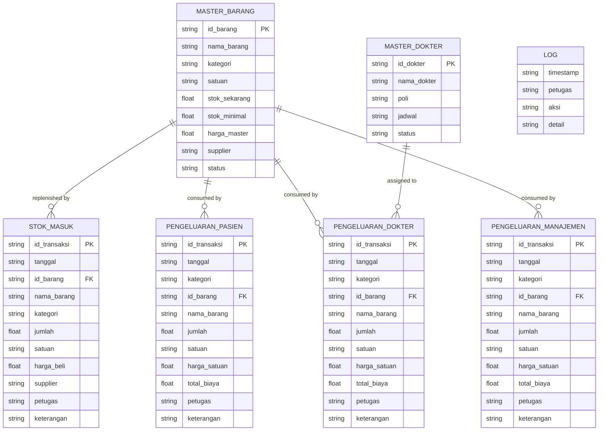
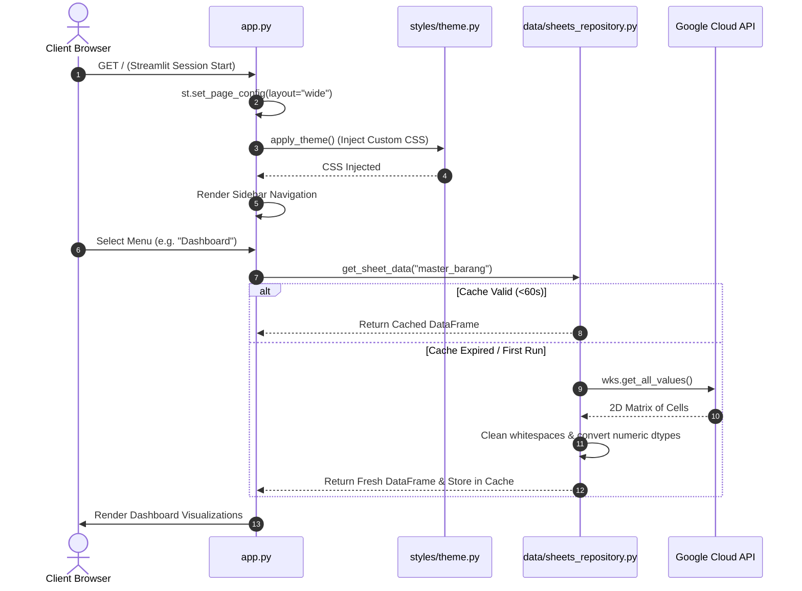
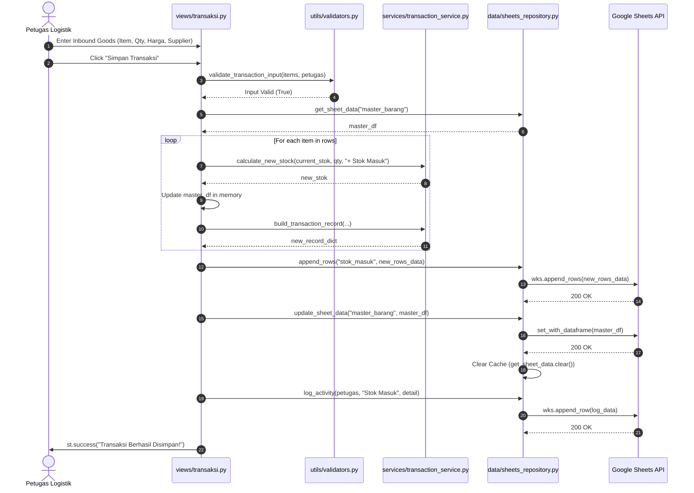
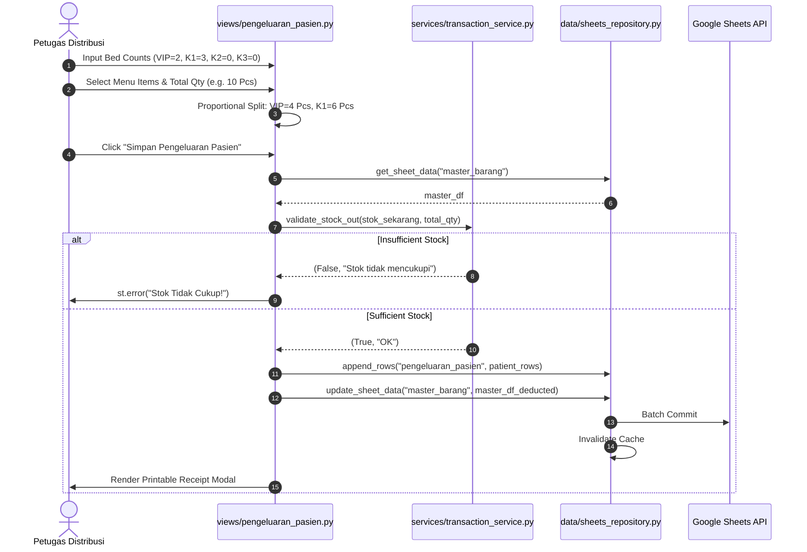
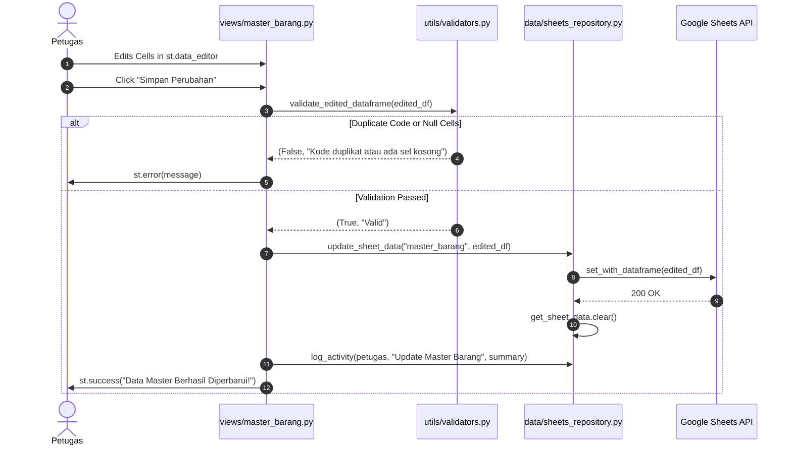
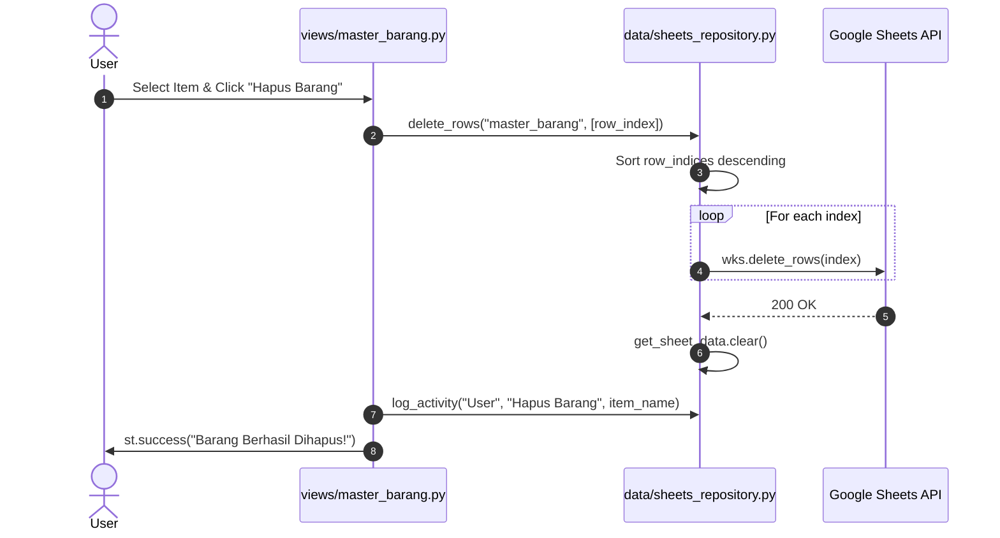
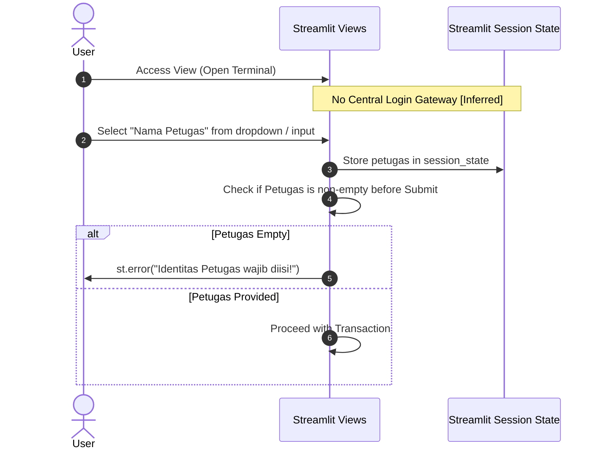
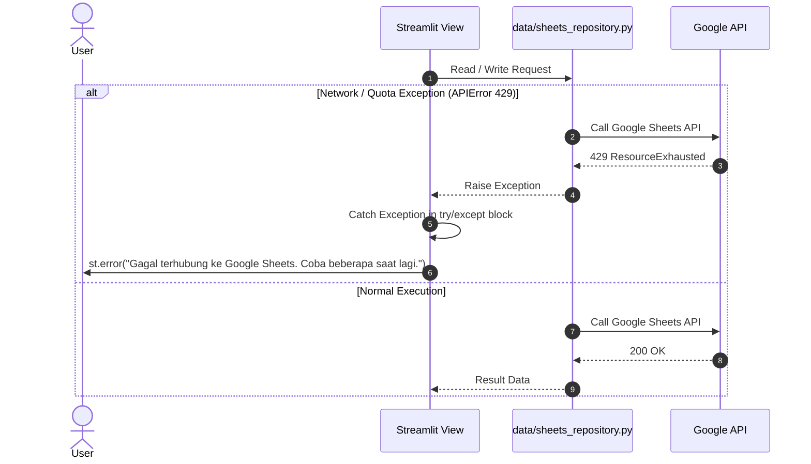

# Architecture Document
## CGIZI — Sistem Informasi Manajemen Stok Gizi RS An-Nisa

---

### 1. Overview & Architectural Style
CGIZI is structured as a **Layered Monolithic Web Application** built atop the Streamlit reactive UI runtime. The application enforces a strict separation of concerns into four core layers:
1. **Presentation / UI Layer (`views/`, `styles/`)**: Streamlit components handling reactive state rendering, widget callbacks, and DOM CSS injection.
2. **Business Logic / Domain Service Layer (`services/`)**: Pure functions isolated from Streamlit APIs, computing stock mathematics, status thresholds, batch allocations, and report aggregations.
3. **Data Access / Repository Layer (`data/sheets_repository.py`)**: Gateway abstraction encapsulating Google Sheets API calls (`gspread` and `gspread-dataframe`), session caching (`@st.cache_data`), and bulk dataframe serialization.
4. **Cross-Cutting Utilities (`utils/`)**: Reusable input validators, security sanitizers, number/currency formatters, and session state initializers.

```
+-------------------------------------------------------------------+
|               Presentation Layer (views/*.py, app.py)             |
|  - Dashboard, Master Data, Transaksi, Pengeluaran, Laporan, Sync  |
+---------------------------------+---------------------------------+
                                  |
                                  v
+---------------------------------+---------------------------------+
|               Domain Service Layer (services/*.py)                |
|  - stock_service.py       - transaction_service.py                |
|  - report_service.py                                              |
+---------------------------------+---------------------------------+
                                  |
                                  v
+---------------------------------+---------------------------------+
|             Data Repository Layer (data/sheets_repository.py)     |
|  - get_sheet_data, update_sheet_data, append_rows, log_activity   |
+---------------------------------+---------------------------------+
                                  |
                                  v
+---------------------------------+---------------------------------+
|               Google Sheets Cloud Database (External)             |
|  - master_barang, master_dokter, stok_masuk, pengeluaran_*, log   |
+-------------------------------------------------------------------+
```

---

### 2. Tech Stack Table

| Layer | Technology | Version / Spec | Purpose in CGIZI |
|---|---|---|---|
| **Language Runtime** | Python | `>=3.10, 3.11` (devcontainer) | Core execution engine |
| **Web UI Framework** | Streamlit | `>=1.30.0` (`requirements.txt`) | Reactive single-page web framework and widget orchestration |
| **Data Processing** | Pandas | `>=2.0.0` (`requirements.txt`) | In-memory tabular calculations, joins, aggregations, and filtering |
| **Visualization** | Plotly | `>=5.18.0` (`requirements.txt`) | Interactive analytical charts in Dashboard and Analisis Stok |
| **Persistence Client** | gspread | `>=5.12.0` (`requirements.txt`) | Google Sheets API v4 Python wrapper |
| **Dataframe Adapter** | gspread-dataframe | `>=3.3.1` (`requirements.txt`) | High-speed 2D batch serialization between Pandas and Sheets |
| **Authentication Client**| google-auth | `>=2.25.0` (`requirements.txt`) | GCP Service Account OAuth2 token negotiation |
| **Testing** | Standalone PyUnit | Standard Library + Whitebox | 92 unit and anomaly tests in `tests/whitebox_test.py` |
| **Configuration** | TOML | `.streamlit/secrets.toml` | GCP service account credentials and spreadsheet ID |

---

### 3. System Context Diagram (C4 Level 1)



---

### 4. Component / Layer Diagram (C4 Level 2)



---

### 5. Project Structure

```
CGIZI/
├── .devcontainer/
│   └── devcontainer.json         # Dev container config (Python 3.11 image)
├── .streamlit/
│   ├── config.toml               # Streamlit server and theme settings
│   ├── secrets.toml              # [GIT-IGNORED] GCP Service Account private key & spreadsheet ID
│   └── secrets.toml.example      # Template for environment secret setup
├── data/
│   ├── __init__.py
│   └── sheets_repository.py      # Google Sheets connection, CRUD, cache management, activity logging
├── docs/
│   ├── PRD.md                    # Product Requirements Document
│   └── ARCHITECTURE.md           # Architecture and technical design document
├── services/
│   ├── __init__.py
│   ├── report_service.py         # Daily summary aggregations, balance movement calculations
│   ├── stock_service.py          # Stock health classifications, percentage & bar rendering math
│   └── transaction_service.py    # Transaction ID generation, stock delta validation, record building
├── styles/
│   ├── __init__.py
│   └── theme.py                  # Custom CSS stylesheets, typography, UI badges, button colors
├── tests/
│   ├── health_check.py           # Automated smoke test verifying view functions and core service logic
│   ├── test_report_service.py    # Unit tests for report calculations
│   ├── test_stock_service.py     # Unit tests for stock status rules
│   ├── test_transaction_service.py # Unit tests for inbound/outbound transactions
│   └── whitebox_test.py          # 92 white-box anomaly test suites covering injections and math boundaries
├── utils/
│   ├── __init__.py
│   ├── formatting.py             # Number, currency (IDR), HTML escaping, and badge builders
│   ├── state.py                  # Streamlit session state management routines
│   └── validators.py             # Input payload validation for master items and transactions
├── views/
│   ├── __init__.py
│   ├── analisis_stok.py          # Stock health charts, category ratio, and valuation analysis
│   ├── dashboard.py              # Executive KPI cards, low-stock warnings, recent activities
│   ├── laporan_harian.py         # Daily stock balance sheet (Beginning + In - Out = Ending)
│   ├── master_barang.py          # Catalog item management with data editor and add form
│   ├── master_dokter.py          # Doctor schedule roster and clinic room assignment
│   ├── pengeluaran.py            # Entry router redirecting to pengeluaran_common
│   ├── pengeluaran_common.py     # Generic expenditure form with in-row package unrolling
│   ├── pengeluaran_dokter.py     # Doctor mass snack grid and individual doctor distribution
│   ├── pengeluaran_pasien.py     # Proportional ward inpatient meal allocation (VIP, K1, K2, K3)
│   ├── riwayat_pengeluaran.py    # Multi-tab historical log with advanced multi-column filtering
│   ├── sinkronisasi.py           # Streamlit cache invalidation and cloud refresh screen
│   └── transaksi.py              # Inbound stock entry with HPP variance detection
├── AGENTS.md                     # AI Agent guidelines and project execution rules
├── app.py                        # Streamlit application entry point and sidebar navigation
├── README.md                     # Project overview and operational guide
└── requirements.txt              # Production Python package dependencies
```

---

### 6. Module Breakdown

#### `data/sheets_repository.py`
- **Responsibility**: Authenticates with Google Drive/Sheets API via GCP Service Account, reads worksheets into Pandas DataFrames, executes atomic cell-range replacements or row appends, and invalidates Streamlit cache.
- **Public Interface**:
  - `get_gspread_client() -> gspread.Client`
  - `get_spreadsheet() -> gspread.Spreadsheet`
  - `get_worksheet(name: str) -> gspread.Worksheet`
  - `get_sheet_data(sheet_name: str) -> pd.DataFrame` (Cached 60s)
  - `update_sheet_data(sheet_name: str, df: pd.DataFrame)`
  - `append_row(sheet_name: str, row_data: list)`
  - `append_rows(sheet_name: str, rows_data: list[list])`
  - `delete_rows(sheet_name: str, row_indices: list[int])`
  - `log_activity(petugas: str, aksi: str, detail: str)`
- **Dependencies**: `gspread`, `gspread_dataframe`, `google.oauth2.service_account`, `streamlit`.

#### `services/stock_service.py`
- **Responsibility**: Pure calculation of stock health percentages, visual progress bar widths, UI color mappings, and status filtering.
- **Public Interface**:
  - `calculate_stock_percentage(stok, min_stok) -> float`
  - `get_stock_status_label(stok, min_stok, status) -> str`
  - `get_stock_bar_width(percentage) -> int`
  - `get_stock_bar_color(status_label) -> str`
  - `filter_by_status(df, status_filter) -> pd.DataFrame`
- **Dependencies**: `pandas`, `math`.

#### `services/transaction_service.py`
- **Responsibility**: Validates outbound stock requests against current balances, calculates prospective balances, formats unique transaction IDs, and builds standard dictionary records.
- **Public Interface**:
  - `generate_transaction_id(existing_count: int) -> str` (e.g. `T0042`)
  - `validate_stock_out(stok_sekarang, jumlah_keluar) -> tuple[bool, str]`
  - `calculate_new_stock(stok_sekarang, jumlah, jenis_transaksi) -> float`
  - `build_transaction_record(...) -> dict`
- **Dependencies**: `datetime`.

#### `services/report_service.py`
- **Responsibility**: Consolidates inbound and outbound transaction series into daily balance statements and financial consumption totals.
- **Public Interface**:
  - `get_daily_summary(df_masuk, df_keluar, date) -> pd.DataFrame`
  - `get_stock_movement_report(df_transaksi, start_date, end_date) -> pd.DataFrame`
  - `calculate_cost_consumption(df_keluar) -> float`
- **Dependencies**: `pandas`.

---

### 7. Data Architecture

#### Entity Relationship Diagram (ERD)


#### Data Dictionary Table

| Entity (Sheet) | Field Name | Data Type | Nullable | Description & Constraints |
|---|---|---|---|---|
| `master_barang` | `id_barang` | string | No | Item identifier (e.g. "BRG001") |
| `master_barang` | `nama_barang` | string | No | Unique item label |
| `master_barang` | `kategori` | string | No | Classification (Bahan Kering, Basah, Snack, Buah, etc.) |
| `master_barang` | `satuan` | string | No | Metric unit (Kg, Pcs, Bks, Liter, Butir) |
| `master_barang` | `stok_sekarang` | float | No | Current physical balance (`>= 0`) |
| `master_barang` | `stok_minimal` | float | No | Low-stock threshold |
| `master_barang` | `harga_master` | float | No | Standard catalog purchase price (HPP in IDR) |
| `master_barang` | `supplier` | string | Yes | Default supplier names (comma-separated if multiple) |
| `master_barang` | `status` | string | No | "True" for monitored stock; "False" for Bahan Bebas |
| `stok_masuk` | `id_transaksi` | string | No | Unique inbound transaction code (e.g. "IN-20261005-001") |
| `stok_masuk` | `tanggal` | string | No | Inbound receipt date (`YYYY-MM-DD`) |
| `stok_masuk` | `jumlah` | float | No | Received quantity (`> 0`) |
| `stok_masuk` | `harga_beli` | float | No | Invoice unit purchase price |
| `stok_masuk` | `petugas` | string | No | Receiving staff name |
| `pengeluaran_*` | `id_transaksi` | string | No | Outbound code (e.g. "OUT-20261005-001") |
| `pengeluaran_*` | `kategori` | string | No | Recipient group (e.g. "VIP", "Dokter Praktek", "Direksi") |
| `pengeluaran_*` | `jumlah` | float | No | Consumed physical quantity (`> 0`) |
| `pengeluaran_*` | `harga_satuan` | float | No | Unit price applied from `master_barang.harga_master` |
| `pengeluaran_*` | `total_biaya` | float | No | Total valuation (`jumlah * harga_satuan`) |
| `log` | `timestamp` | string | No | ISO / local formatted audit timestamp |
| `log` | `aksi` | string | No | Action type (e.g. "Stok Masuk", "Tambah Barang") |

#### Migration Strategy
Because Google Sheets is a schema-on-read tabular datastore, migrations are performed by executing code scripts (or manually in Google Sheets) to add columns. Column orders are preserved by reading headers dynamically via `df.columns` in `data/sheets_repository.py`.

---

### 8. System Flows

#### Flow 1: Application Startup and Initialization

*Step-by-step*:
1. Streamlit receives client HTTP connection and executes `app.py`.
2. `st.set_page_config` sets browser tab title and full-width layout.
3. `styles/theme.py:apply_theme()` injects custom CSS for metric cards, tables, and buttons.
4. User selects a navigation view from `st.sidebar.radio`.
5. The view requests dataframes via `sheets_repository.py:get_sheet_data(sheet_name)`.
6. `@st.cache_data(ttl=60)` checks if the cached dataframe exists and is fresh; if not, requests raw cells from Google Sheets API, parses them via Pandas, caches them, and returns.

#### Flow 2: Inbound Stock Creation Request (Create)

*Step-by-step*:
1. Staff fills out dynamic input rows for received items.
2. `utils/validators.py:validate_transaction_input` checks for non-empty petugas and positive quantities.
3. For each row, `services/transaction_service.py:calculate_new_stock` computes the incremented balance.
4. `data/sheets_repository.py:append_rows` sends new rows to `stok_masuk`.
5. `data/sheets_repository.py:update_sheet_data` replaces `master_barang` with the updated dataframe.
6. `get_sheet_data.clear()` invalidates cache.
7. `data/sheets_repository.py:log_activity` writes an audit trail.

#### Flow 3: Outbound Inpatient Meal Distribution (Read, Compute & Deduct)


#### Flow 4: Master Catalog Update & Edit


#### Flow 5: Row Deletion Flow


#### Flow 6: Authentication & Authorization Flow


#### Flow 7: Error Handling & Resilience Flow


---

### 9. API Design
CGIZI does not expose a public REST or GraphQL HTTP API. It operates as a server-side rendered application where user interactions trigger internal Streamlit component callbacks:
- **Internal Contract**: Functions in `services/` and `data/` communicate via typed Python arguments and Pandas DataFrames.
- **Data Serialization**: Two-way dataframe conversions via `gspread_dataframe` (`get_as_dataframe` and `set_with_dataframe`).
- **Data Export Formats**: Users can download CSV or Microsoft Excel (`.xlsx`) files via `st.download_button` in `views/riwayat_pengeluaran.py` and `views/laporan_harian.py`.

---

### 10. Security Architecture
- **Authentication**: Physical terminal trust model. Staff select their identity via UI inputs (`petugas`).
- **Authorization**: Flat access model. All screens are universally accessible from the sidebar.
- **Secrets Management**: Service account private keys are isolated inside `.streamlit/secrets.toml` which is ignored by git (`.gitignore`).
- **Injection Protection**: In-memory HTML rendering utilizes `utils/formatting.py:escape_html` to prevent stored Cross-Site Scripting (XSS).
- **Known Weaknesses**:
  - Lack of password authentication permits unauthorized impersonation on unattended stations.
  - Lack of fine-grained Google Sheets cell-level locks; the GCP Service Account possesses broad Editor permissions on the entire spreadsheet.

---

### 11. Configuration & Environments

#### Environment Matrix
- **Development**: Local machine running `streamlit run app.py` with `.streamlit/secrets.toml`.
- **Container**: VS Code DevContainer using `.devcontainer/devcontainer.json` on Python 3.11 image.
- **Production**: Streamlit Community Cloud or local on-premise server with production Google Sheet ID in secrets.

#### Secrets & Configuration Variables Table
| Config Key | Storage Location | Type | Description |
|---|---|---|---|
| `spreadsheet_id` | `secrets.toml` | string | Google Sheets Unique Identifier |
| `gcp_service_account.type` | `secrets.toml` | string | "service_account" |
| `gcp_service_account.project_id` | `secrets.toml` | string | GCP Project ID |
| `gcp_service_account.private_key_id` | `secrets.toml` | string | Key identifier |
| `gcp_service_account.private_key` | `secrets.toml` | string | RSA private key string |
| `gcp_service_account.client_email` | `secrets.toml` | string | Service account email |

---

### 12. Deployment & Infrastructure
- **Hosting Pattern**: Streamlit server process (port 8501).
- **Devcontainer**: `.devcontainer/devcontainer.json` installs Python 3.11 with automatic post-create dependency installation via `pip install -r requirements.txt`.
- **Stateless Web Tier**: Streamlit application server holds minimal session state; all persistent states reside in Google Sheets.

---

### 13. Observability
- **Audit Logging**: Every transaction and master edit is appended to the `log` worksheet via `data/sheets_repository.py:log_activity(petugas, aksi, detail)`.
- **Application Logs**: Console stdout/stderr outputs standard Streamlit operational telemetry.
- **Telemetry Deficit**: No external APM (e.g. Sentry, Datadog) currently integrated `[Inferred]`.

---

### 14. Testing Strategy
- **Framework**: Python Standard Library + Custom Test Runners.
- **Suites**:
  - `tests/test_stock_service.py`: Stock percentages, status badges, bar width clamping.
  - `tests/test_transaction_service.py`: Transaction ID generation, stock delta validation.
  - `tests/test_report_service.py`: Daily balance and consumption aggregations.
  - `tests/health_check.py`: Smoke testing verifying imports and module linkages.
  - `tests/whitebox_test.py`: 92 boundary tests covering XSS injection, division by zero, float precision, and simulated race conditions.
- **Coverage Gaps**: No automated end-to-end browser integration tests (e.g. Playwright/Selenium) for Streamlit UI interactions.

---

### 15. Architectural Decisions (ADR)

#### ADR-001: Google Sheets as Persistent Datastore `[Inferred]`
- **Context**: The hospital nutrition department required rapid cloud access, zero-cost database infrastructure, and spreadsheet familiarity.
- **Decision**: Adopt Google Sheets via `gspread` and `gspread-dataframe` instead of a SQL database.
- **Consequence**: Zero database server maintenance, but subjects the app to API rate limits (60 writes/min) and potential concurrency overwrite hazards.

#### ADR-002: Streamlit for Full-Stack Presentation `[Inferred]`
- **Context**: Rapid development of data-centric dashboards without needing a separate React/Vue frontend and FastAPI/Django backend.
- **Decision**: Use Streamlit to build reactive web screens in pure Python.
- **Consequence**: Fast development speed, but standardizes full-page re-execution on user input changes requiring aggressive caching (`@st.cache_data`).

#### ADR-003: In-Memory Virtual Package Unrolling
- **Context**: Patients and doctors receive composite packages (e.g. "Paket Snack"), but physical inventory tracks individual raw cakes and drinks.
- **Decision**: Decompose packages into physical sub-items in Python memory during transaction submission before writing to Google Sheets.
- **Consequence**: Google Sheets always holds true physical inventory balances; virtual packages never pollute stock ledgers.

---

### 16. Technical Debt & Risks

| Issue / Debt | Impact | Severity | Recommended Fix |
|---|---|---|---|
| **Race Conditions on Stock Updates** | Two simultaneous users can overwrite each other's stock balance calculations. | High | Implement optimistic locking by tracking a version column in `master_barang`. |
| **Reverse Stock Calculation in Reports** | Daily reports recalculate past opening stock by subtracting subsequent transactions in memory. | Medium | Store daily closing snapshots in a dedicated `stok_harian` worksheet. |
| **No Transaction Reversal UI** | Staff cannot void erroneous entries directly from the web interface. | Medium | Add a "Batalkan Transaksi" action in `riwayat_pengeluaran.py` that reverses inventory balances. |
| **Google Sheets 60s Cache Stale Window** | If user A submits a transaction, user B might see stale data for up to 60 seconds if cache is not cleared globally. | Low | Configure Streamlit cache keys with short TTL or broadcast cache purge events. |

---

### 17. Scalability & Improvement Recommendations
1. **Database Migration**: When transaction volume exceeds 20,000 rows, migrate data layer to SQLite (local) or PostgreSQL (cloud) using SQLAlchemy ORM.
2. **Authentication Middleware**: Introduce lightweight JWT or session-based PIN login per staff member.
3. **Automated Offline Fallback**: Implement local SQLite caching so the nutrition department can continue recording meal distribution even during internet outages.
