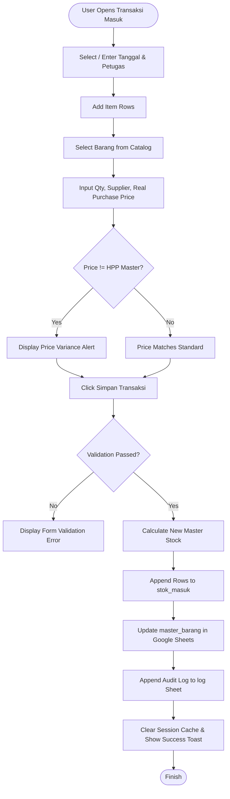
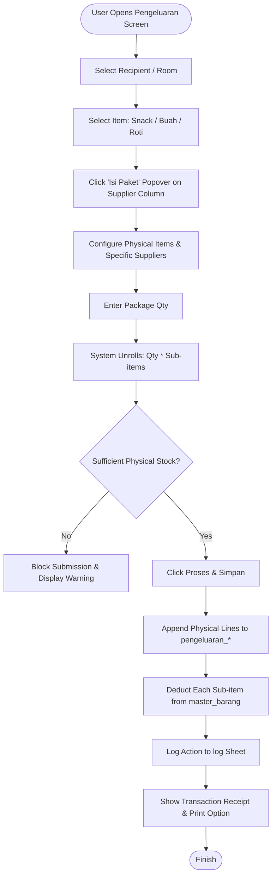

# Product Requirements Document (PRD)
## CGIZI — Sistem Informasi Manajemen Stok Gizi RS An-Nisa

---

### 1. Document Information
- **Title**: Product Requirements Document (PRD) — CGIZI (Sistem Manajemen Stok Instalasi Gizi)
- **Version**: 1.0.0
- **Date**: 2026-10-05
- **Status**: Active / Reverse-Engineered from Source Code
- **Repository**: `c:\Users\mfadh\OneDrive\Documents\1D\CGIZI`

---

### 2. Overview & Purpose
CGIZI is a web-based inventory and expenditure management system tailored for the Nutrition Installation (Instalasi Gizi) at RS An-Nisa. The application manages dry and wet food supplies, tracks inbound transactions, monitors stock consumption across clinical (inpatient rooms) and non-clinical departments (physicians, management, and auxiliary units), calculates real-time inventory valuations, and produces daily and periodic reconciliation reports.

The application replaces manual paper logs and fragmented spreadsheets by centralizing all master data and transaction ledgers onto Google Sheets as a persistent cloud database, surfaced through an interactive Streamlit UI.

---

### 3. Goals and Non-Goals

#### Goals
- Provide real-time tracking of food ingredients and supplies with automatic stock level recalculations (`services/stock_service.py:calculate_new_stock`).
- Streamline mass meal/snack disbursements for patients across care classes (VIP, Kelas 1, Kelas 2, Kelas 3) using proportional bed distribution algorithms (`views/pengeluaran_pasien.py:render_pengeluaran_pasien`).
- Support composite package distribution (Snack, Buah, Roti) that unrolls virtual packages into individual physical stock deductions tied to specific suppliers (`views/pengeluaran_common.py`, `views/pengeluaran_dokter.py`).
- Maintain historical expenditure logs with multi-column filtering, date ranges, and CSV/Excel export functionality (`views/riwayat_pengeluaran.py`).
- Monitor stock health via status tiers (Habis, Kritis, Menipis, Aman, Bahan Bebas) and generate automated low-stock warnings (`services/stock_service.py:get_stock_status_label`).

#### Non-Goals
- Multi-tenant hospital support (the system is single-tenant for RS An-Nisa).
- Native Electronic Health Record (EHR) / Hospital Information System (HIS) HL7/FHIR real-time sync `[Inferred]`.
- Native point-of-sale payment gateway or patient billing processing.
- Multi-role granular Role-Based Access Control (RBAC) with individual user passwords (the current system operates on shared station authentication with staff name identification `[Inferred]`).

---

### 4. Target Users & Personas

Derived from user entry points, input fields, and audit log parameters (`data/sheets_repository.py:log_activity`, `views/transaksi.py:render_transaksi`):

| Persona | Role | Primary Responsibility in CGIZI | Key Needs |
|---|---|---|---|
| **Petugas Logistik Gizi** | Inventory Officer | Receives goods from vendors, enters incoming stock (`stok_masuk`), manages master item catalog (`master_barang`). | Quick entry, supplier assignment, HPP vs Real price comparison, stock alert visibility. |
| **Petugas Distribusi / Penyaji** | Food Distribution Staff | Disburses meals and snacks to inpatient rooms, doctors' clinics, and management events. | Proportional patient distribution, composite package unrolling, rapid multi-row entry. |
| **Kepala Instalasi Gizi** | Nutrition Dept Head | Reviews daily reports, monitors expenditure budgets, audits stock levels. | Stock valuation metrics, turnover trends, historical filtering, exportable audit trails. |
| **Admin IT / Tim DTO** | System Administrator | Synchronizes Google Sheets cache, investigates transaction discrepancies. | Cache invalidation, data consistency check, sheet connectivity monitoring. |

---

### 5. User Stories

#### Module: Master Data (`views/master_barang.py`, `views/master_dokter.py`)
- **US-001**: As a *Petugas Logistik Gizi*, I want to create, edit, and categorize food inventory items, so that inventory records reflect active hospital pantry supplies.
- **US-002**: As a *Petugas Logistik Gizi*, I want to configure minimum stock thresholds and flag items as exempt ("Bahan Bebas"), so that non-perishables do not trigger false critical alerts.
- **US-003**: As a *Petugas Distribusi*, I want to maintain a roster of practicing and on-duty doctors, so that clinic snack/beverage allocations are accurately mapped to recipient physicians.

#### Module: Inbound Transactions (`views/transaksi.py`)
- **US-004**: As a *Petugas Logistik Gizi*, I want to record incoming stock items with batch supplier, quantity, and real purchase price, so that inventory quantities and financial totals increase accurately.
- **US-005**: As a *Petugas Logistik Gizi*, I want the system to alert me if the real purchasing price differs from the catalog HPP, so that price variance is tracked immediately.

#### Module: Outbound Transactions (`views/pengeluaran_pasien.py`, `views/pengeluaran_dokter.py`, `views/pengeluaran_common.py`)
- **US-006**: As a *Petugas Distribusi*, I want to enter total patient headcounts across VIP, Kelas 1, Kelas 2, and Kelas 3 and have the system calculate item portions per class, so that ward pantry billing is proportionally allocated without manual math.
- **US-007**: As a *Petugas Distribusi*, I want to configure composite packages (e.g., Snack Box containing bolu and lemper from Koprasi) right within the item row, so that one package action automatically deducts multiple physical pantry ingredients.
- **US-008**: As a *Petugas Distribusi*, I want the system to block submission if physical stock is insufficient, so that negative inventory is prevented.

#### Module: Reports & Audit (`views/dashboard.py`, `views/laporan_harian.py`, `views/riwayat_pengeluaran.py`, `views/analisis_stok.py`)
- **US-009**: As a *Kepala Instalasi Gizi*, I want an overview dashboard displaying critical stock alerts, total inventory valuation, and transaction counts, so that I can make timely procurement decisions.
- **US-010**: As a *Kepala Instalasi Gizi*, I want to filter and export outbound consumption history by date range, department, and recipient, so that cost audits can be submitted to hospital management.

---

### 6. Functional Requirements

| Requirement ID | Description | Priority | Source File Reference |
|---|---|---|---|
| **FR-001** | Connect to Google Sheets spreadsheet using GCP Service Account credentials stored in Streamlit secrets. | Must | `data/sheets_repository.py:get_gspread_client` |
| **FR-002** | Fetch and cache worksheet dataframes with a 60-second TTL to balance speed and sheet quota. | Must | `data/sheets_repository.py:get_sheet_data` |
| **FR-003** | Invalidate data cache immediately upon create, update, delete, or append actions. | Must | `data/sheets_repository.py:update_sheet_data`, `append_rows` |
| **FR-004** | Master Barang catalog CRUD: create new item, update existing item attributes, soft/hard delete items. | Must | `views/master_barang.py:render_master_barang` |
| **FR-005** | Master Dokter roster CRUD: register physician names, practice schedules, and assigned clinic rooms. | Should | `views/master_dokter.py:render_master_dokter` |
| **FR-006** | Inbound stock recording: batch entry of incoming goods, updating `stok_sekarang` in `master_barang` and logging to `stok_masuk`. | Must | `views/transaksi.py:render_transaksi` |
| **FR-007** | Inbound price variance warning: highlight price differences between catalog HPP Master and actual invoice price. | Should | `views/transaksi.py:render_transaksi` |
| **FR-008** | Inpatient meal distribution: distribute food items across 4 ward tiers proportionally based on entered patient counts. | Must | `views/pengeluaran_pasien.py:render_pengeluaran_pasien` |
| **FR-009** | Doctor pantry allocation: multi-row doctor snack distribution with single-click population of active roster. | Must | `views/pengeluaran_dokter.py:render_pengeluaran_dokter` |
| **FR-010** | Management and auxiliary unit expenditure form: dynamic row additions for administrative meetings and units. | Must | `views/pengeluaran_common.py:render_form` |
| **FR-011** | Composite package unrolling: automatically decompose Snack, Buah, and Roti virtual bundles into constituent physical inventory lines. | Must | `views/pengeluaran_common.py`, `views/pengeluaran_dokter.py` |
| **FR-012** | Stock sufficiency validation: prevent transaction execution if required quantity exceeds available physical stock. | Must | `services/transaction_service.py:validate_stock_out`, `views/pengeluaran_common.py` |
| **FR-013** | Activity audit logging: write staff name, action, timestamp, and details to `log` worksheet. | Must | `data/sheets_repository.py:log_activity` |
| **FR-014** | Expenditure history exploration: comprehensive filtering by date, shift, category, recipient, and full-text search. | Must | `views/riwayat_pengeluaran.py:render_riwayat_pengeluaran` |
| **FR-015** | Daily report generation: compute daily balance sheet (Opening Stock + In - Out = Ending Stock) and export to Excel/CSV. | Must | `views/laporan_harian.py:render_laporan_harian` |
| **FR-016** | Inventory analytics: visualize stock status composition, category breakdowns, and consumption trends via Plotly charts. | Should | `views/analisis_stok.py:render_analisis_stok` |
| **FR-017** | Manual cache purge: UI button to clear Streamlit internal cache and re-sync all dataframes from Google Sheets. | Could | `views/sinkronisasi.py:render_sinkronisasi` |

---

### 7. Non-Functional Requirements (NFR)

#### Performance
- Page load time under 2.5 seconds on local networks leveraging Streamlit `@st.cache_data(ttl=60)` (`data/sheets_repository.py`).
- Batch updates (`gspread_dataframe.set_with_dataframe` and `wks.append_rows`) must be used instead of cell-by-cell writes to avoid Google API 429 Rate Limit (Quota: 60 write requests per minute per user).

#### Security
- GCP Service Account JSON credentials must never be committed to git; enforced via `.gitignore` and `.streamlit/secrets.toml` pattern (`secrets.toml.example`).
- HTML string inputs rendered in UI must be sanitized against script injection (`utils/formatting.py:escape_html`).
- *Current Gap*: Authentication is station-based; any staff member on the terminal can choose any petugas name in the selectbox `[Inferred]`.

#### Reliability & Data Integrity
- Transaction rollback emulation: when writing multiple transaction records, updates to master stock balances are committed in single batch blocks to prevent partial failures (`data/sheets_repository.py:update_sheet_data`).
- Boundary safety: division-by-zero guards on patient counts, minimum stocks, and stock percentages (`services/stock_service.py:calculate_stock_percentage`, `tests/whitebox_test.py`).

#### Maintainability
- Layered separation of concerns: UI views in `views/`, business calculation logic in `services/`, Google Sheets persistence in `data/`, formatting in `utils/`.
- Unit test verification via `python tests/whitebox_test.py` covering 92 edge cases.

---

### 8. Core Entities & Business Rules

#### Entity 1: Master Barang (`master_barang`)
- **Key**: `id_barang` (string, e.g., "BRG001") or `nama_barang`.
- **Columns**: `id_barang`, `nama_barang`, `kategori`, `satuan`, `stok_sekarang`, `stok_minimal`, `harga_master`, `supplier`, `status`.
- **Rules**:
  - `status == "True"` represents active monitored stock.
  - `status == "False"` represents "Bahan Bebas" (unlimited/untracked items). If `stok_minimal == 0` or `status == "False"`, item is never classified as "Habis" or "Kritis" (`services/stock_service.py:get_stock_status_label`).
  - `harga_master` represents standard HPP and cannot be negative.

#### Entity 2: Inbound Stock (`stok_masuk`)
- **Columns**: `id_transaksi`, `tanggal`, `id_barang`, `nama_barang`, `kategori`, `jumlah`, `satuan`, `harga_beli`, `supplier`, `petugas`, `keterangan`.
- **Rules**:
  - `jumlah` must be strictly positive (`> 0`).
  - Upon submission, `master_barang.stok_sekarang` is incremented by `jumlah`.

#### Entity 3: Outbound Transactions (`pengeluaran_pasien`, `pengeluaran_dokter`, `pengeluaran_manajemen`)
- **Shared Schema**: `id_transaksi`, `tanggal`, `kategori` (e.g. Ruangan/Poli/Unit), `id_barang`, `nama_barang`, `jumlah`, `satuan`, `harga_satuan`, `total_biaya`, `petugas`, `keterangan`.
- **Rules**:
  - Virtual items (Snack, Buah, Roti) must be decomposed into real items prior to persistence.
  - Real items deduct from `master_barang.stok_sekarang`.
  - Non-unlimited items must have `stok_sekarang >= jumlah`.

#### Stock Level Classification Matrix (`services/stock_service.py`)
```
If status == False or stok_minimal == 0:
    -> "Bahan Bebas" (Blue Badge)
Else if stok_sekarang <= 0:
    -> "Habis" (Dark Red Badge)
Else if stok_sekarang <= stok_minimal:
    -> "Kritis" (Red Badge)
Else if stok_sekarang <= (stok_minimal * 1.25):
    -> "Menipis" (Yellow Badge)
Else:
    -> "Aman" (Green Badge)
```

---

### 9. Screen & Feature Inventory

| Screen Name | View Function | Data Source (Sheet Tab) | Primary Actions | Auth / Guard |
|---|---|---|---|---|
| **📊 Dashboard** | `views/dashboard.py:render_dashboard` | `master_barang`, `stok_masuk`, `pengeluaran_*` | Summary KPI cards, stock status alerts, recent transaction logs. | Open Station |
| **📦 Master Barang** | `views/master_barang.py:render_master_barang` | `master_barang` | Add item, edit table inline, toggle item active status, filter by category. | Open Station |
| **👨‍⚕️ Master Dokter** | `views/master_dokter.py:render_master_dokter` | `master_dokter` | Register doctor names, set practice sessions (Pagi/Sore), set clinic location. | Open Station |
| **📥 Transaksi Masuk** | `views/transaksi.py:render_transaksi` | `stok_masuk`, `master_barang` | Multi-row batch inbound goods receipt, supplier mapping, HPP variance alert. | Staff Name Required |
| **📤 Pengeluaran Pasien** | `views/pengeluaran_pasien.py:render_pengeluaran_pasien` | `pengeluaran_pasien`, `master_barang` | Input ward bed counts (VIP, K1, K2, K3), multi-item meal deduction, proportional split. | Staff Name Required |
| **👨‍⚕️ Pengeluaran Dokter** | `views/pengeluaran_dokter.py:render_pengeluaran_dokter` | `pengeluaran_dokter`, `master_barang` | Distribute snacks/fruits to practicing doctors, unroll composite packages per row. | Staff Name Required |
| **🏢 Pengeluaran Manajemen** | `views/pengeluaran.py:render_pengeluaran` | `pengeluaran_manajemen`, `master_barang` | Log consumables for office management, auxiliary units, and events with in-row package configuration. | Staff Name Required |
| **📋 Riwayat Pengeluaran** | `views/riwayat_pengeluaran.py:render_riwayat_pengeluaran` | `pengeluaran_pasien`, `pengeluaran_dokter`, `pengeluaran_manajemen` | Consolidated history, advanced multi-column filtering, CSV/Excel export. | Open Station |
| **📈 Analisis Stok** | `views/analisis_stok.py:render_analisis_stok` | `master_barang`, `stok_masuk`, `pengeluaran_*` | Valuation charts, stock health distribution, category ratio breakdown. | Open Station |
| **📑 Laporan Harian** | `views/laporan_harian.py:render_laporan_harian` | `master_barang`, `stok_masuk`, `pengeluaran_*` | Date-filtered daily movement balance sheet, cost consumption summary. | Open Station |
| **🔄 Sinkronisasi Data** | `views/sinkronisasi.py:render_sinkronisasi` | All Sheets | Invalidate Streamlit cache, reload fresh data from Google Sheets API. | Open Station |

---

### 10. User Flows

#### Inbound Stock Receipt Journey (Create)


#### Outbound Composite Package Journey (Unroll & Deduct)


---

### 11. Acceptance Criteria (Given / When / Then)

#### AC-001: Inbound Stock Ingestion
- **Given** item "Beras Ramos" exists in `master_barang` with `stok_sekarang = 50.0` and `harga_master = 14000`.
- **When** Petugas "Fajar" submits inbound transaction of `jumlah = 25.0`, `harga_beli = 14500`, and `supplier = "CV Berkah"`.
- **Then** a new record is appended to `stok_masuk`, `master_barang.stok_sekarang` updates to `75.0`, and an audit row is written to `log`.

#### AC-002: Insufficient Stock Prevention
- **Given** item "Susu UHT 1L" has `stok_sekarang = 4.0` and `status = "True"`.
- **When** Petugas requests `jumlah = 5.0` in `pengeluaran_pasien`.
- **Then** the form displays `"Ada barang yang stoknya tidak mencukupi"`, the submit button is disabled or rejected, and no sheets are modified.

#### AC-003: Virtual Package Decomposition
- **Given** "Paket Snack" is configured with `0.5x Bolu Pisang (Koprasi)` and `1.0x Lemper Ayam (Berkah)`.
- **When** Petugas submits `10` portions of "Paket Snack" for "Dokter Jaga".
- **Then** `pengeluaran_dokter` receives 2 rows (5 Bolu Pisang, 10 Lemper Ayam), and `master_barang` deducts 5 Bolu and 10 Lemper respectively.

---

### 12. Current Gaps & Risks

1. **Absence of User Authentication**: System relies on a voluntary text or dropdown input for `Petugas`. Anyone with network access to the Streamlit port can submit transactions under any name.
2. **Google Sheets Concurrency & Race Conditions**: Google Sheets lacks native row-level transactions. If two staff members simultaneously disburse stock for the same item, the second write will overwrite `stok_sekarang` calculated from stale memory (`tests/whitebox_test.py:7. Logika Bisnis`).
3. **No Automatic Daily Snapshotting**: Opening stock calculations in `laporan_harian.py` are reconstructed on-the-fly by reverse-aggregating historical transactions from the current stock, which becomes computationally expensive as transaction rows grow beyond thousands.
4. **Google Sheets API Quota Limits**: Re-reading full sheets on frequent page refreshes can hit the 300 read requests per minute limit if multiple terminals are open.
5. **No Soft Deletion Flag on Transactions**: Erroneous outbound entries must be manually deleted from Google Sheets; the UI has no void/cancel transaction workflow.

---

### 13. Suggested Roadmap

- **Now (Sprint 1-2)**:
  - Add simple password or PIN login per staff member using Streamlit session auth.
  - Implement a transaction void/reversal button in `riwayat_pengeluaran.py` with automatic stock restoration.
- **Next (Sprint 3-4)**:
  - Implement optimistic locking in `sheets_repository.py` by checking version/timestamp before updating `master_barang`.
  - Add automated scheduled backup of Google Sheets to local CSV or cloud storage.
- **Later (Sprint 5+)**:
  - Migrate persistent backend from Google Sheets to PostgreSQL or SQLite while keeping Streamlit frontend.
  - Integrate barcode/QR scanner input for inbound vendor deliveries and outbound pantry dispatches.

---

### 14. Assumptions & Open Questions

#### Assumptions
- The hospital operates on a trusted internal intranet where terminal access is restricted to authorized nutrition staff.
- Daily transactions do not exceed 500 rows per day, staying well within Google Sheets' 10-million cell limit.
- Commodity prices in `harga_master` reflect average moving cost or latest purchase price as determined by the hospital procurement team.

#### Open Questions
- Is there a requirement to integrate directly with RS An-Nisa's central SIMRS database for automated patient inpatient counts instead of manual input?
- Should stock items ever be allowed to go negative in emergencies (e.g. life-saving enteral nutrition), with a retroactive replenishment workflow?
- Who has the formal authorization to modify `harga_master` (HPP)? Currently any user can edit it in `master_barang.py`.
