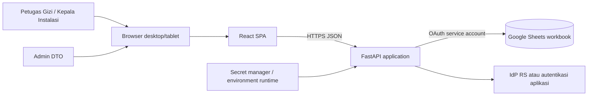
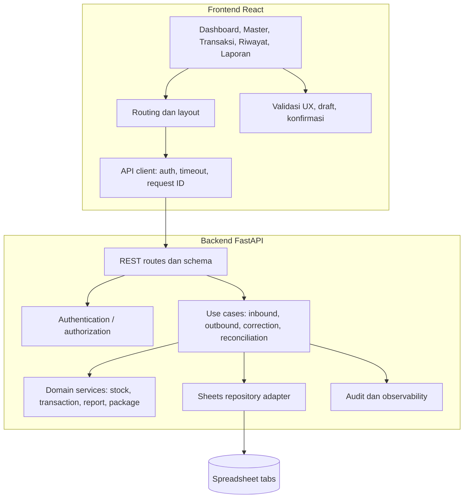

# Arsitektur Target CGIZI React

| Atribut | Nilai |
|---|---|
| Versi | 1.0 Draft |
| Tanggal | 5 Oktober 2026 |
| Status | Usulan target; belum diimplementasikan |
| Sasaran | React web, API Python, Google Sheets tetap sebagai storage awal |

## 1. Keputusan Utama

**Gunakan React sebagai frontend, FastAPI sebagai backend/API, dan akses Google Sheets hanya dari backend memakai service account.** Pertahankan logika bisnis Python yang relevan setelah dipisahkan dari Streamlit. Jangan memanggil Google Sheets langsung dari browser: hal itu membocorkan credential dan membuat validasi stok dapat dilewati.

Google Sheets masih dapat digunakan untuk single-site dan volume operasional yang moderat, tetapi bukan basis data transaksional. Target ini harus membatasi mutasi menjadi satu jalur backend, memakai request batch, idempotency, pencatatan hasil operasi, serta pemeriksaan/rekonsiliasi. Jika jaminan transaksi multi-user yang kuat menjadi syarat, migrasikan ledger/saldo ke PostgreSQL atau database transaksional; Sheets dapat dipertahankan sebagai ekspor atau pelaporan.

## 2. Baseline dan Batas Migrasi

Baseline yang teramati:

- `app.py` menjadi router Streamlit dan `views/` memuat form dan alur bisnis UI.
- `services/` berisi perhitungan stok/transaksi/laporan, tetapi kode aktif dan kontrak dokumen tidak sepenuhnya seragam.
- `data/sheets_repository.py` mengikat `gspread` ke Streamlit cache/secrets dan menyimpan DataFrame dengan clear lalu set.
- Alur input transaksi memperbarui tab master dan ledger secara berurutan; alur pasien/koreksi juga dapat memperbarui FIFO dan log.
- Dokumen lama berbeda pada nama kolom dan beberapa deskripsi fitur. Kontrak storage belum boleh dibekukan tanpa memeriksa workbook produksi.

Strategi: strangler migration dengan API baru, mapping legacy eksplisit, pembacaan/parity check dahulu, mutasi pilot setelah failure handling diuji, dan satu penulis aktif saat cutover.

## 3. Diagram Konteks (C4 L1)



## 4. Komponen (C4 L2)



## 5. Tanggung Jawab Lapisan

### Frontend (`frontend/`)

- Render pengalaman pengguna, route guarding untuk UX, validasi awal, state form, konfirmasi, loading/error/empty states.
- Memanggil API melalui satu client; tidak mengandung private key, service account JSON, atau kode `gspread`.
- Tidak menjadi sumber kebenaran saldo, harga, permission, ID transaksi, atau alokasi final.
- Untuk daftar besar gunakan paging/filter API; jangan mengunduh seluruh workbook tanpa kebutuhan.

### Backend (`backend/`)

- FastAPI memvalidasi request/response dengan model Pydantic dan mengotorisasi setiap operasi.
- Domain services murni Python tanpa import Streamlit atau akses Google.
- Use case mengatur urutan baca, validasi, penulisan, idempotency, audit, dan error mapping.
- Repository menangani OAuth, pembacaan tab, schema mapping, normalisasi tipe, batch update, retry terbatas untuk error aman, serta cache server.
- Operasi Sheets tidak boleh dijalankan di thread event loop secara blocking; gunakan eksekusi worker/thread yang sesuai atau API client async yang teruji.

### Data

- Google Sheets merupakan sumber persistent legacy pada fase awal.
- Tab existing: `master_barang`, `master_dokter`, `stok_masuk`, `pengeluaran_pasien`, `pengeluaran_dokter`, `pengeluaran_manajemen`, `log`.
- Tambahkan `id_transaksi`/`id_operasi` dan version metadata hanya setelah strategi kompatibilitas dan persetujuan pemilik sheet.
- Jangan menyimpan token sesi, password plaintext, atau key private di spreadsheet.

## 6. Struktur Repo Target (Usulan)

```text
CGIZI/
├── frontend/
│   ├── src/
│   │   ├── api/              # API client dan kontrak
│   │   ├── app/              # router, auth, layout
│   │   ├── features/         # master, inbound, outbound, reports
│   │   ├── components/       # komponen lintas fitur
│   │   └── styles/
│   ├── package.json
│   └── vite.config.js
├── backend/
│   ├── app/main.py
│   ├── api/v1/               # routes/dependencies
│   ├── schemas/              # request/response Pydantic
│   ├── services/             # domain murni
│   ├── use_cases/            # mutasi lintas entitas
│   ├── repositories/         # Sheets adapter dan interface
│   ├── security/             # auth dan permission
│   ├── observability/
│   └── tests/
├── services/                 # kode Streamlit legacy selama transisi
├── views/                    # UI legacy sampai cutover
├── docs2/
└── tests/                    # legacy tests; susun ulang saat migrasi
```

Struktur tersebut bukan instruksi untuk memindahkan semua legacy sekaligus. Pindahkan/pergunakan domain logic satu per satu dan pertahankan import lama sampai pengujian menunjukkan tidak ada regresi.

## 7. Kontrak Data dan Skema Canonical

### 7.1 Skema legacy yang harus dipetakan

| Sheet | Field yang terlihat di kode atau health check |
|---|---|
| `master_barang` | `kode_barang`, `nama_barang`, `kategori`, `satuan`, `stok_sekarang`, `stok_minimum`, `harga_master`, `status`; pemakaian juga mengacu ke `supplier` dan `harga_real` |
| `stok_masuk` | `tanggal`, `shift`, `kategori`, `petugas`, `supplier`, `nama_barang`, `qty`, `harga_master`, `harga_real`, `total_harga`, `keterangan`, `sisa_qty` |
| `pengeluaran_*` | `tanggal`, `shift`, `kategori`, `petugas`, `nama_barang`, `supplier`, `qty`, harga, `total_harga`, `keterangan`; pasien dapat memiliki tujuan dan jumlah pasien |
| `master_dokter` | Tab teridentifikasi; kolom nama/poli/jadwal/status dirujuk dokumentasi/kode, perlu validasi workbook |
| `log` | Tab aktivitas; bentuk kolom harus diperiksa |

Pemetaan kandidat: `id_barang` -> `kode_barang`, `stok_minimal` -> `stok_minimum`, `jumlah` -> `qty`. Terapkan alias pada adapter; jangan ganti nama header existing secara diam-diam. Ambil sampel header aktual dan backup workbook sebelum mapping final.

### 7.2 DTO/API canonical (usulan)

- `Item`: `itemId`, `code`, `name`, `category`, `unit`, `stockOnHand`, `minimumStock`, `standardPrice`, `supplier`, `isStockTracked`, `isActive`, `version`.
- `InboundLine`: `itemId`, `quantity`, `purchasePrice`, `supplier`, `note`.
- `Transaction`: `transactionId`, `type`, `occurredAt`, `shift`, `category`, `destination`, `actorId`, `lines[]`, `status`, `createdAt`.
- `TransactionLine`: `itemId`, `itemNameSnapshot`, `supplier`, `quantity`, `unit`, `standardPriceSnapshot`, `actualPrice`, `lineTotal`, `packageSource?`.
- `AuditEvent`: `eventId`, `actorId`, `action`, `entityType`, `entityId`, `timestamp`, `reason`, `requestId`, `result`.

ID canonical berbentuk stabil (misalnya UUID), dibuat server; migrasi record lama dapat menggunakan ID hasil mapping deterministik hanya jika collision dan deduplikasi dianalisis. Jangan memakai indeks baris Sheets sebagai ID eksternal permanen.

## 8. API REST yang Diusulkan

Prefix `/api/v1`; JSON UTF-8; timestamp ISO 8601; semua route terlindungi kecuali readiness terbatas.

| Method/Path | Tujuan |
|---|---|
| `GET /health/live` | Proses API hidup, tanpa dependency check mahal |
| `GET /health/ready` | Kesiapan API dan dependency status yang disanitasi |
| `GET /api/v1/me` | Identitas dan permission pengguna |
| `GET /api/v1/items` | Filter/paging barang; `q`, `category`, `supplier`, `stockStatus`, `active` |
| `POST /api/v1/items` | Membuat item dengan validasi/izin |
| `GET/PATCH /api/v1/items/{itemId}` | Detail/perubahan atribut non-saldo; saldo melalui adjustment |
| `GET/POST/PATCH /api/v1/doctors` | Roster dokter |
| `POST /api/v1/inbound-transactions` | Penerimaan batch |
| `POST /api/v1/outbound-transactions` | Pengeluaran dengan type `patient`, `doctor`, atau `management` |
| `GET /api/v1/transactions` | Riwayat, filter, paging |
| `GET /api/v1/transactions/{transactionId}` | Detail dan baris fisik |
| `POST /api/v1/transactions/{transactionId}/adjustments` | Koreksi beralasan dan dampak stok terhitung |
| `POST /api/v1/transactions/{transactionId}/void` | Pembatalan/reversal berizin |
| `GET /api/v1/dashboard` | Agregat dashboard |
| `GET /api/v1/reports/daily` | Laporan saldo/pergerakan harian |
| `GET /api/v1/reports/stock` | Laporan stok dan nilai |
| `GET /api/v1/admin/sheets/schema` | Pemeriksaan header/tab, admin only, read-only |
| `POST /api/v1/admin/sheets/refresh` | Invalidasi cache backend, admin only |
| `POST /api/v1/admin/reconciliation` | Jalankan pemeriksaan rekonsiliasi, admin only |

Request mutasi wajib memiliki `Idempotency-Key`. Respons sukses menyertakan ID transaksi dan waktu; retry dengan key sama mengembalikan hasil sebelumnya. Error mengikuti bentuk seragam: `code`, `message`, `fieldErrors?`, `requestId`, `details?` yang tidak sensitif. Gunakan status HTTP yang tepat (400/401/403/404/409/422/429/502/503).

## 9. Alur Mutasi Transaksi

1. Autentikasi aktor dan cek role.
2. Validasi request, format tanggal, batas ukuran, idempotency key, dan referensi.
3. Serialisasi operasi mutasi (MVP: satu worker penulis/lock dalam satu proses; lock proses bukan koordinasi antar-replika).
4. Baca ulang saldo, item, supplier, penerimaan/FIFO yang dibutuhkan; jangan gunakan cache sebagai dasar mutasi.
5. Expand paket dan hitung semua kebutuhan per item/supplier; validasi total gabungan, aturan bahan bebas, pembulatan dan harga.
6. Bentuk perubahan ledger/master/FIFO/audit dan operasi idempotency.
7. Kirim perubahan dengan satu batch Sheets API bila feasible dan diuji. Hindari `clear()` seluruh tab untuk transaksi rutin. Jika satu request batch tidak dapat mencakup operasi dengan aman, catat operasi sebagai pending/failed dan sediakan rekonsiliasi/kompensasi.
8. Verifikasi hasil sesuai kebutuhan, simpan hasil idempotency, invalidasi cache, emit audit/metrics.
9. Kembalikan ID transaksi. Untuk kegagalan sebelum commit, tidak ada write. Untuk hasil tidak pasti setelah timeout, cari idempotency/operation marker sebelum retry.

Peringatan penting: lock in-process hanya cukup bila tepat satu instance API aktif dan semua writer menggunakan API yang sama. Tidak ada jaminan kuat jika Streamlit, manusia, script lain, atau API replica lain tetap menulis workbook.

## 10. Cache, Konsistensi, dan Kuota

- Cache hanya untuk read model seperti dashboard/master yang tidak digunakan sebagai saldo final mutasi.
- TTL harus diputuskan dari uji beban; tampilkan waktu pembaruan bila hasil mungkin stale.
- Setiap write berhasil menginvalidasi cache terkait; refresh memuat ulang sheet tanpa menulis.
- Gunakan batch reads/writes dan operasi range; hindari cell-by-cell. Monitor quota dan retry hanya untuk error transient dengan exponential backoff/jitter dan batas retry.
- Tetapkan batas ukuran workbook, jumlah request per pengguna, batas range, dan degradasi layanan.
- Buat rekonsiliasi berkala: master balance dibanding saldo ledger; penerimaan tersisa dibanding FIFO; total nilai dibanding laporan.

## 11. Keamanan

- Service account hanya di backend, akses hanya ke workbook yang diperlukan. Simpan secret di secret manager atau environment terenkripsi; file JSON tidak berada di repository/build.
- Credential JSON yang terlihat/terlacak di working tree atau pernah terpublikasi perlu dikaji dan dirotasi; jangan menyalin atau memasukkan isinya ke dokumentasi/log.
- TLS untuk seluruh koneksi; CORS allowlist origin frontend; cookie sesi `HttpOnly`, `Secure`, `SameSite` bila autentikasi cookie digunakan; proteksi CSRF yang sesuai.
- OIDC/SSO RS direkomendasikan; jika belum tersedia, gunakan login dengan password hash kuat dan mekanisme reset yang disetujui, bukan PIN bersama sebagai keamanan utama.
- Otorisasi minimal per route/action; validasi aktor di server. Audit login, write, export, koreksi, dan admin actions.
- Batasi PII: jangan memasukkan identitas pasien ke query/log bila tidak dibutuhkan; tetapkan retensi dan akses.
- Sanitasi/encoding output, lindungi CSV formula injection pada ekspor, validasi input, rate limit, dan batas payload.
- Error frontend tidak menampilkan traceback; log server tidak merekam token, private key, atau isi secret.

## 12. Deployment dan Operasional

Target deployment berupa satu origin HTTPS bila memungkinkan (`/` untuk React, `/api` untuk FastAPI) untuk menyederhanakan CORS dan cookie. Backend berjalan pada private network/managed runtime RS dengan secret injection. Gunakan satu API writer selama Sheets menjadi sumber transaksi; jangan menambah horizontal replica penulis tanpa distributed lock/queue dan desain konsistensi.

Pipeline minimum: lint/type/syntax, unit tests domain, API contract tests, integration tests memakai mock/salinan workbook, frontend build, dependency/security scan, deploy staging, smoke test, lalu approval produksi. Readiness memeriksa konfigurasi dan akses read-only; jangan melakukan write test ke workbook produksi.

Backup: snapshot spreadsheet terjadwal dengan retensi dan akses terbatas; uji restore/rekonsiliasi. Tentukan RPO/RTO dengan RS. Alert untuk 429, 5xx Sheets, p95 latency, mutasi ambigu, konflik, dan rekonsiliasi gagal.

## 13. Strategi Pengujian

- Unit: stock thresholds, normalisasi angka Indonesia, IDR, alokasi pasien, paket, FIFO, rounding, validasi qty/stok, koreksi delta.
- API: auth/roles, schema validation, idempotency, kontrak error, filter/paging, audit.
- Repository: alias kolom, header hilang, DataFrame kosong/NaN, batch request, cache invalidation, retry/timeout memakai mock.
- Integration: salinan workbook non-produksi, operasi multi-tab, kegagalan antara write, dua request bersamaan, retry setelah timeout.
- UI: jalur keyboard/form, error/empty/loading, responsive tablet, pencegahan submit ganda.
- UAT: rekonsiliasi sampel periode dan tanda tangan stakeholder.

## 14. Strategi Migrasi dan Cutover

1. Inventarisasi workbook dan ekspor snapshot read-only; dokumentasikan headers, formula, jumlah baris, duplicates, dan ID null.
2. Bentuk schema mapping dan skrip validasi read-only; bandingkan output API dengan Streamlit untuk laporan/stock.
3. Buat backend read-only, auth, logging, dan frontend shell.
4. Implementasi mutasi memakai data salinan; uji batch, idempotency, concurrent writes, failure recovery, quota.
5. UAT operasional dan rekonsiliasi saldo. Perbaiki data hanya dengan persetujuan dan audit terpisah.
6. Backup produksi, tentukan jendela cutover, hentikan mutasi Streamlit/script/manual, nyalakan satu penulis API, verifikasi saldo/ledger.
7. Pertahankan rollback ke snapshot dan prosedur menangani transaksi yang masuk setelah snapshot; jangan mengaktifkan dua penulis tanpa rekonsiliasi.
8. Setelah stabil, dekomisioning Streamlit ditetapkan oleh pemilik proses.

## 15. ADR Ringkas

- **ADR-001: React + Python API.** Dipilih untuk memisahkan UX dari aturan bisnis dan menggunakan kembali logika Python. Konsekuensi: perlu dua toolchain dan kontrak API.
- **ADR-002: Sheets hanya melalui backend.** Dipilih untuk melindungi credential dan menegakkan izin/validasi. Konsekuensi: backend menjadi dependency kritis.
- **ADR-003: Sheets hanya storage transisi.** Diterima karena kebutuhan mempertahankan spreadsheet, bukan karena setara database. Konsekuensi: satu writer dan batas konsistensi; evaluasi DB transaksional berdasarkan volume/konflik.
- **ADR-004: Skema canonical lewat adapter.** Dipilih agar header legacy tetap kompatibel dan API tidak membawa variasi `id_barang`/`kode_barang`, `qty`/`jumlah` ke UI.

## 16. Keputusan yang Wajib Ditutup Sebelum Build Mutasi

Schema workbook aktual; ID transaksi dan item; hak akses/autentikasi; aturan stok minimum/Bahan Bebas; formula distribusi pasien dan rounding; FIFO lintas supplier; bentuk persistence paket; audit dan koreksi; zona waktu; jumlah pengguna serentak; kebutuhan availability; deployment/backup; dan kriteria perpindahan dari Sheets ke database.
